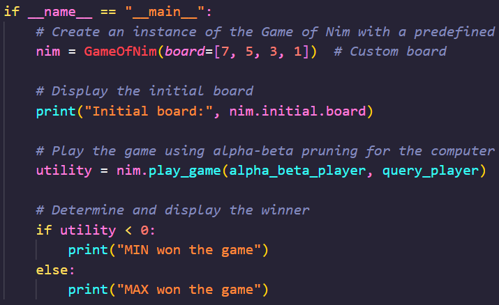

# Game of Nim AI Using Nim-Sum

## Contributers

Dylan Zuniga, Elizabeth Steubs, Kelvin Nguyen

## About the Project

This project implements an intelligent AI system for playing the Game of Nim, featuring a graphical user interface and advanced decision-making capabilities. The AI uses alpha-beta pruning enhanced with Nim-Sum evaluation to make optimal moves efficiently.

### Built with

[![Python][Python.org]][Python-url]

### Files

`game_of_nim.py`  

This is the main file you will run to play the game. Comment out the other version of main that wont be in use

* To play terminal version, you will use this version of main

* To play the GUI version, you will use this version of main

`games.py`  

This file stores all the necessary object classes for the game AI to run. It includes the structure of the games and the games AI.

### Sources

* [Wikipedia - Game of Nim](https://en.wikipedia.org/wiki/Nim)
* [Nim-Sum evaluation function](https://www.geeksforgeeks.org/combinatorial-game-theory-set-2-game-nim/)

[Python.org]: https://img.shields.io/badge/Python-3670A0?style=for-the-badge&logo=python&logoColor=ffdd54
[Python-url]: https://www.python.org/
