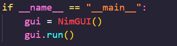

## About the Project

Description here

### Built with

* [![Python][Python.org]][Python-url]

`game_of_nim.py`  
This is the main file you will run to play the game. Comment out the other version of main that wont be in use

* To play terminal version, you will use this version of main

* To play the GUI version, you will use this version of main

`games.py`  

`utils.py`  

### Sources

* [Wikipedia - Game of Nim](https://en.wikipedia.org/wiki/Nim)
* [Nim-Sum evaluation function](https://www.geeksforgeeks.org/combinatorial-game-theory-set-2-game-nim/)

## Getting started

### Prerequisities 

### Installation

[Python.org]: https://img.shields.io/badge/Python-3670A0?style=for-the-badge&logo=python&logoColor=ffdd54
[Python-url]: https://www.python.org/
